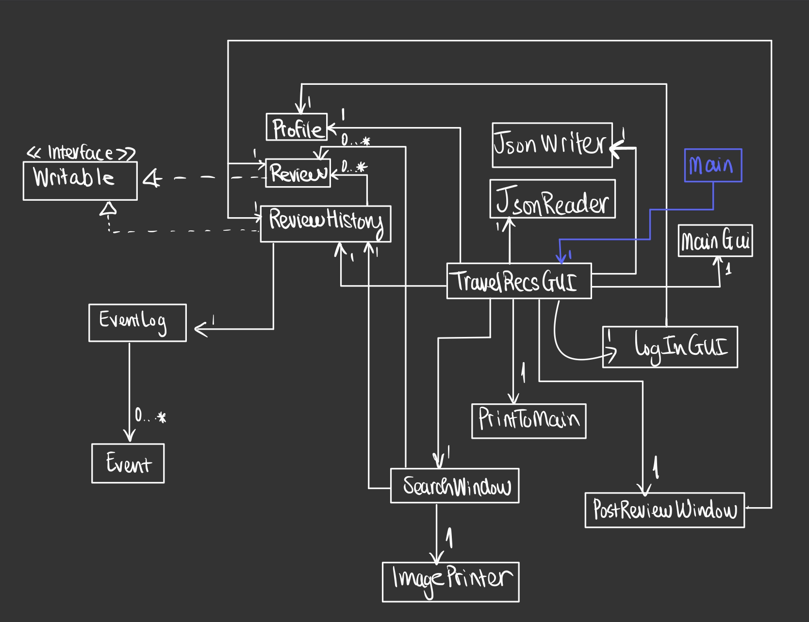

# WANDERLUST

## Explore, Dream, Live

Code referenced from https://github.students.cs.ubc.ca/CPSC210/TellerApp

Persistence components referenced from https://github.students.cs.ubc.ca/CPSC210/JsonSerializationDemo

Logging referenced from https://github.students.cs.ubc.ca/CPSC210/AlarmSystem

This application is a hub for any travel enthusiasts or beginners to explore and collect information as well as reviews 
on destinations all around the world. You can then curate travel plans to your interests, 
and meet some friends along the way!

I created this project because one of my goals is to be able to see all the pretty places
in the world, and to experience new cultures by meeting new people. I think that the hardest part about travelling
is coming up with a plan and deciding on which places to visit.

Phase 1: User story  
As a user, I want to be able to:
- Add a tag to a list of tags that describes the city
- Add a recommendation to a list of recommendations of things to do in the city
- Write a rating, a small comment, and some recommendations of things to do in the city
- Create a profile for myself, that includes saving my name and hometown to my profile
- Add the review the user just made to a list of previously made reviews (review history)
- Display all the city reviews I just made

Phase 2: User story
- auto-save all the reviews made by the current profile to a database of reviews at the end of session
- Display all the reviews that the user has made in current session with command p
- User has the option to save their reviews to file after everytime they write a review
- Load reviews from previously made file with command l
- Name of person who posted the review is shown on each of their reviews

Phase 3: additional user stories
- user can search for a city, shows all reviews of the city

Phase 4: Task 2  
Example Log printed to console

Fri Apr 01 12:24:59 PDT 2022  
A review for Hanoi was added to the current database (aka ReviewHistory)

Fri Apr 01 12:24:59 PDT 2022  
A review for Vancouver was added to the current database (aka ReviewHistory)

Fri Apr 01 12:24:59 PDT 2022  
A review for Ottawa was added to the current database (aka ReviewHistory)

Fri Apr 01 12:24:59 PDT 2022  
A review for Ottawa was added to the current database (aka ReviewHistory)

Fri Apr 01 12:24:59 PDT 2022  
A review for Paris was added to the current database (aka ReviewHistory)

Fri Apr 01 12:27:21 PDT 2022  
A review for Hanoi was added to the current database (aka ReviewHistory)

Fri Apr 01 12:27:21 PDT 2022  
A review for Vancouver was added to the current database (aka ReviewHistory)

Fri Apr 01 12:27:21 PDT 2022  
A review for Ottawa was added to the current database (aka ReviewHistory)

Fri Apr 01 12:27:21 PDT 2022  
A review for Ottawa was added to the current database (aka ReviewHistory)

Fri Apr 01 12:27:21 PDT 2022  
A review for Paris was added to the current database (aka ReviewHistory)

Fri Apr 01 12:27:25 PDT 2022  
Searched for Ottawa

Fri Apr 01 12:27:28 PDT 2022  
A review for Hanoi was added to the current database (aka ReviewHistory)

Fri Apr 01 12:27:28 PDT 2022  
A review for Vancouver was added to the current database (aka ReviewHistory)

Fri Apr 01 12:27:28 PDT 2022  
A review for Ottawa was added to the current database (aka ReviewHistory)

Fri Apr 01 12:27:28 PDT 2022  
A review for Ottawa was added to the current database (aka ReviewHistory)

Fri Apr 01 12:27:28 PDT 2022  
A review for Paris was added to the current database (aka ReviewHistory)

Fri Apr 01 12:27:31 PDT 2022  
Searched for vancouver

Note: Logging implemented for adding a Review to ReviewHistory (happens when your write a review/when reviews are 
loaded from file) and when the user searches for a city. Due to the way the search functionality was implemented 
(it searches the data in the file, instead of the current ReviewHistory),
reviews from data has to be loaded first (it adds reviews to reviewHistory again) before search can happen.

UML Diagram

  

Refactoring and changes to improve this design:
- Use Observer Pattern to control what gets printed on the screen instead of creating different classes and windows
each time something gets displayed
- Profile, Review, and ReviewHistory are getting called from too many places in the program. The design can be improved
by having only one class that access these classes and branch them out to TravelGui to use them however it wants
- TravelRecsGUI makes calls to too many classes in the program. It would be beneficial to divide actions into categories
  (for example: actions that prints out, background actions --> these can be made into interfaces if there are similar 
functionalities such as printing to screen)
- Instead of having smaller functionality classes like LogInGUI, SearchWindow, PostReviewWindow associate with the model
objects, the big class TravelRecsGUI can connect these smaller classes to the model objects --> reduce associations 
- Another reason why there are so many classes being called by TravelRecsGUI is that a new window is created for 
posting reviews and searching the database. Both of these can be implemented on the main window so there aren't too many
JFrames and JPanels being passed around classes.
- When implementing the user interface, I focused on getting visual components to work without paying much attention
to the overall design of the ui package. If more time was given, I would draw out an effective UML diagram and write 
code according to it.
